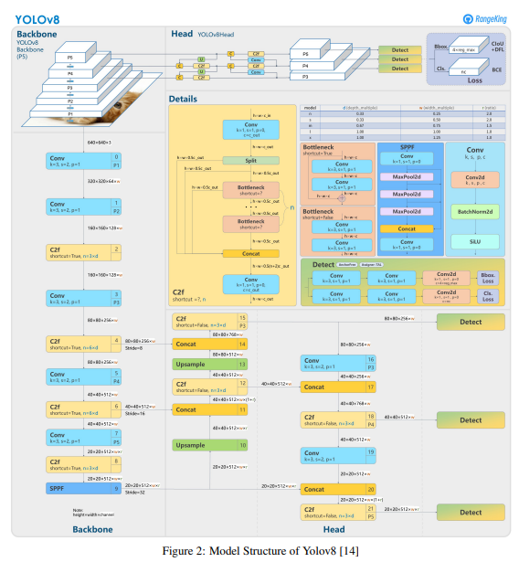

# BDD100K - Model selection, architecture and steps to execute

This folder contains utilities to:
1. Convert **BDD100K** labels to **COCO** format  
2. Run **YOLOv8n** inference and export **COCO-style detections**  

YOLOv8 **weights** are placed at: `weights/yolov8n.pt`.

---

## Contents

- `config.py` — centralizes paths for BDD images/labels and output files  
- `bdd2coco.py` — converts BDD JSON → **COCO GT JSON** (+ optional image attributes JSON)  
- `infer_bdd.py` — runs YOLOv8 inference on images and writes **COCO detections JSON**  

---

## 0. Environment Setup

```bash
# Core libs
pip install -r requirements.txt
```

## 1. Convert BDD → COCO (Ground Truth)

Adjust paths or use those already set in config.py.

Convert the annotations to COCO format

```
python scripts\bdd2coco.py --bdd_json "/path/to/bdd100k/labels/bdd100k_labels_images_val.json" --images_root "/path/to/bdd100k/images/100k/val" --out "./outputs/val_gt_coco.json" --attrs_out "./outputs/val_image_attrs.json"
```

### Why COCO format?

COCO (Common Objects in Context) is one of the most widely adopted formats for object detection, segmentation, and keypoint tasks.

It defines a standard JSON schema with images, annotations, categories, and info.

### Benefits of COCO format:

- Compatible with pycocotools evaluation API → compute standard metrics (mAP@[.5:.95], AP50, APS/M/L).

- Many frameworks (YOLO, Detectron2, MMDetection) natively support COCO, avoiding custom evaluation logic.

- Enables benchmarking and comparability with prior work and other models.

In this repo:
BDD100K annotations were converted into COCO format to make evaluation consistent, reproducible, and comparable with standard benchmarks.

## 2. Inference with YOLOv8n → COCO Detections

Keeping weights at weights/yolov8n.pt.
Recommended: --imgsz 1536 for traffic lights/signs, --tta 1 for better AP50.

```
python scripts\infer_bdd.py --weights "weights\yolov8x.pt" --images_dir "/path/to/bdd100k/images/100k/val" " --out_json "outputs\val_dt_coco.json" --imgsz 1536 --tta 1

```
### Instructions
- Tiny objects: Use larger input sizes (imgsz=960–1536) for YOLO.
- Dense scenes: Consider class-wise NMS to avoid suppressing nearby traffic lights.
- Imbalance: Cars dominate; bikes/riders/trains are rare → monitor per-class AP.
- Qualitative checks: Always review day/night/rain/fog scenarios alongside metrics.

## 3. Model Choice, Reasoning & Architecture 
Chosen Model: YOLOv8n (nano, anchor-free)

### Why YOLOv8n?
- Extremely fast for training & inference → rapid iteration.
- Multi-scale feature fusion + anchor-free head → better handling of small objects (traffic lights, signs).
- Pretrained on COCO → strong transfer learning baseline.

#### Trade-offs:
- Lower capacity → weaker for rare/tiny classes (rider, bike, train).
- Needs larger imgsz (≥960) to improve APS.

#### Architecture:

- Backbone: C2f blocks extract hierarchical features.
- Neck: PAN/FPN-style fusion for multi-scale detection.
- Head: Decoupled prediction for class/objectness/box; anchor-free regression.
- Loss: BCE (cls,obj) + CIoU for bounding boxes.
- 


#### Dataset Characteristics:

- ~1.2M objects across 10 classes.

- Heavy class imbalance (cars dominate; bikes/riders/trains are rare).

- Many tiny objects (traffic lights/signs, faraway pedestrians).

- Diverse conditions (day/night, rain/fog/clear).

#### Why YOLOv8n is a good fit:

- Speed & practicality: training full YOLOv8-s/m/l/x on BDD100K is very resource-intensive. YOLOv8n provides quick iteration and baseline establishment.

- Anchor-free head: better suited for detecting small objects without anchor prior tuning.

- Multi-scale neck: helps detect objects across varying scales (close cars vs. faraway pedestrians).

- Transfer learning from COCO: overlap in categories (car, person, bus, truck, etc.) ensures a strong starting baseline.

#### Limitations & Mitigations:

- Limited capacity → poor recall for long-tail classes (bike, rider, train).

- Mitigation: increase imgsz (960–1536), train longer, or scale up to YOLOv8s.

- Dense scenes → risk of NMS suppression.

- Mitigation: use class-wise NMS or adjust IoU thresholds.

#### Rationale for BDD100K: 
- Dataset is dominated by small, dense objects → YOLOv8n with higher input size balances speed and recall.
- YOLOv8n provides a practical baseline: lightweight, fast, and sufficient to highlight BDD100K challenges like tiny objects and imbalance. It balances speed with recall, making it a sound first choice.

## 4. File Structure
```
repo/
├─ scripts/
│  ├─ config.py
│  ├─ bdd2coco.py
│  └─ infer_bdd.py
├─ weights/
│  └─ yolov8n.pt
├─ outputs/
│  ├─ train_gt_coco.json
│  ├─ val_gt_coco.json
│  ├─ val_dt_coco.json
│  └─ ...

```