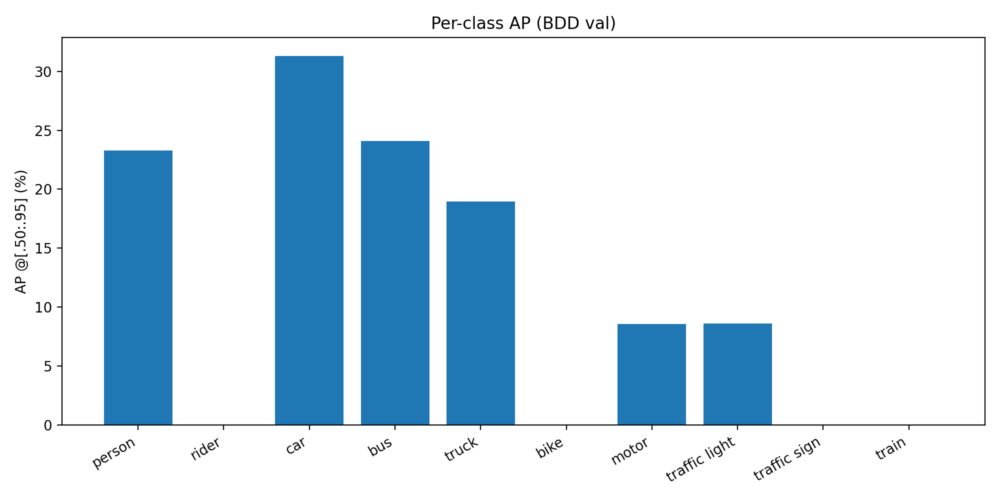
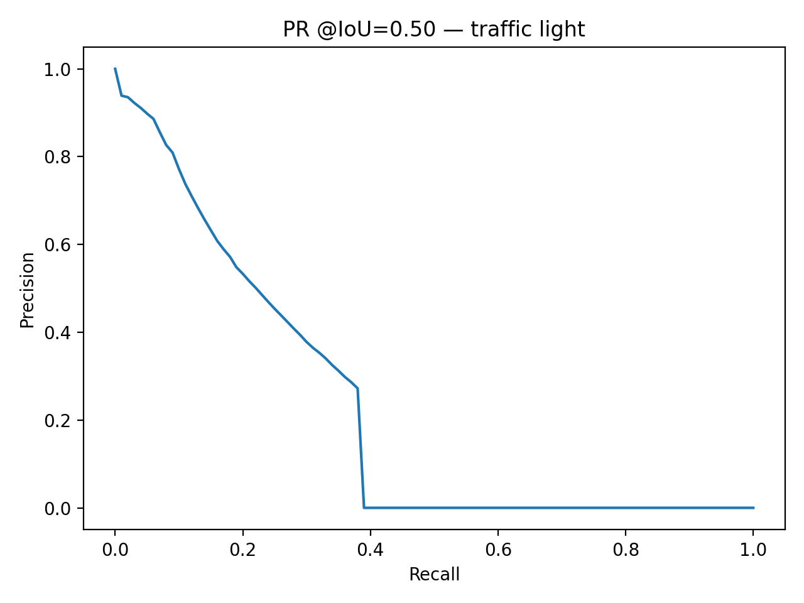
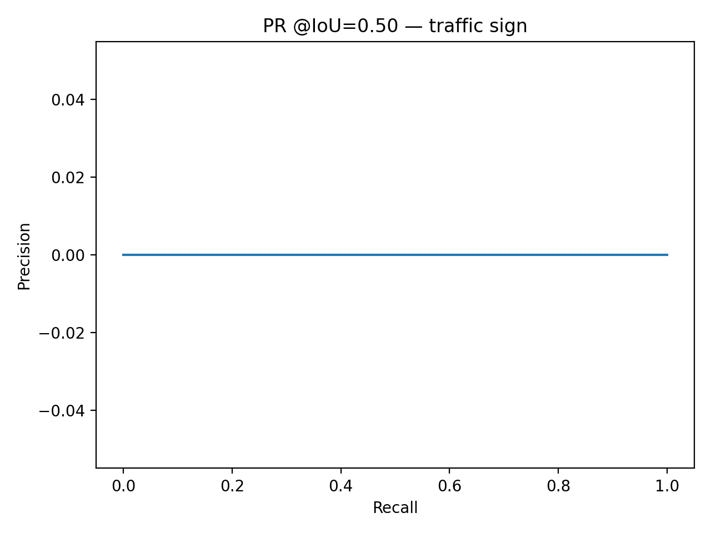
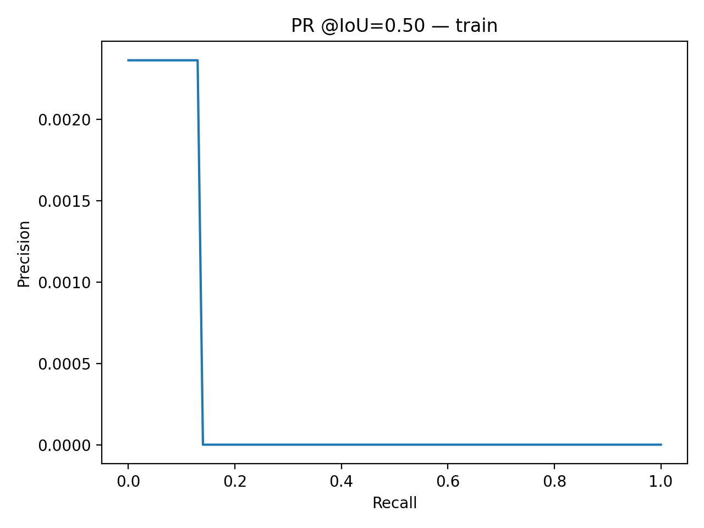
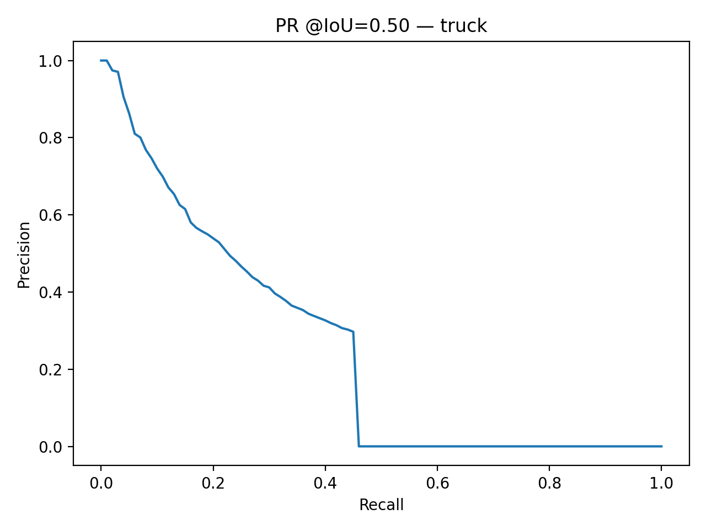
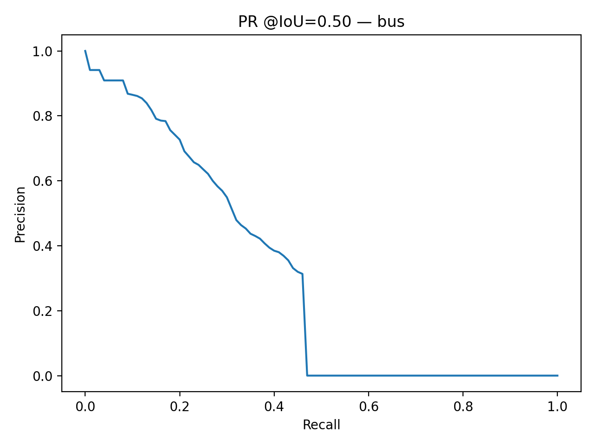
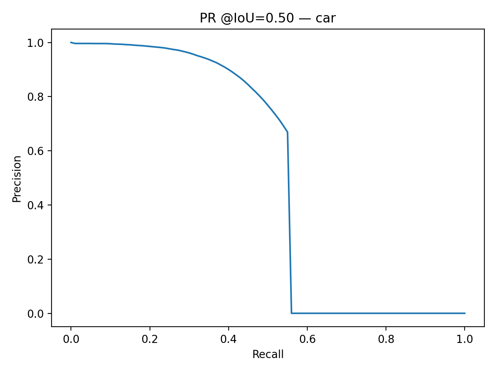
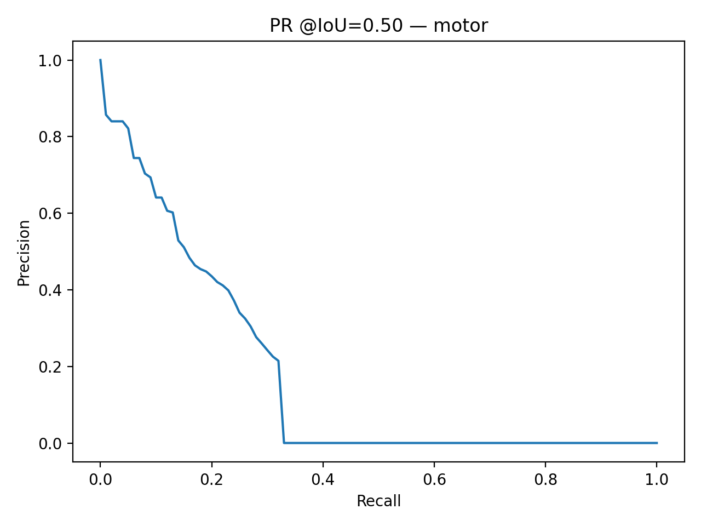
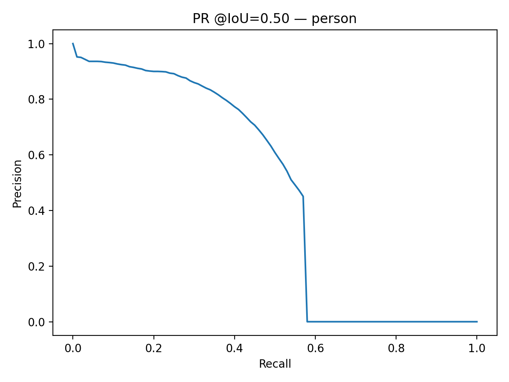
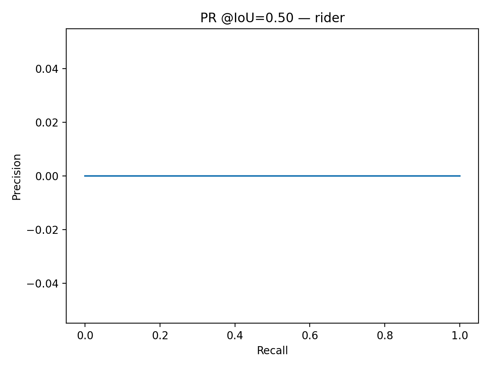

# BDD100K - YOLOv8 Evaluation, Metrics & Insights

This repository contains scripts and utilities to:
1. Convert **BDD100K** labels to **COCO** format  
2. Run **YOLOv8n** inference on BDD images  
3. Evaluate performance with COCO metrics (mAP, AP50, APS/M/L)  
4. Analyze results per class, per condition (weather, time of day, scene)  
5. Visualize per-class AP and Precision–Recall curves  
6. Compare predictions vs. ground truth  

# Step-by-Step Execution

## Evaluate on BDD Validation Set
```
python scripts\eval_bdd.py --gt_json "outputs\val_gt_coco.json" --dt_json "outputs\val_dt_coco.json"
```

## Evaluate by Weather Condition
```
python scripts\eval_by_weather.py --gt_json "outputs\val_gt_coco.json" --dt_json "outputs\val_dt_coco.json" --attrs_json "outputs\val_image_attrs.json"

```

## Per-Class Metrics
```
python scripts\per_class_metrics.py --gt_json "outputs\val_gt_coco.json" --dt_json "outputs\val_dt_coco_yolov8n.json" --out_json "outputs\per_class_metrics_yolov8n.json"

```

## Generate PR Curves
```
python plot_pr_curve.py --gt_json "outputs\val_gt_coco.json" --dt_json "outputs\val_dt_coco_yolov8n.json" --eval_json "outputs\preds_val_eval_yolov8n.json"  --top_k 10

```

## Side-by-Side Predictions
```
python scripts\pred_side_by_side.py --images_dir path\to\data\bdd100k_images_100k\bdd100k\images\100k\val --dt_json outputs\val_dt_coco_yolov8n.json --gt_json outputs\val_gt_coco.json --n 10

```

## Per-Class AP Bar Plot
```
python scripts/plot_per_class_ap.py --eval_json "./outputs/per_class_metrics_yolov8n.json" --out_png "./outputs/per_class_ap.png"
```

# Evaluation Insights
## Per-Class AP (BDD Val)




These curves indicate that Car and Bus maintain higher precision across recall, while Rider and Bike show poor performance.

- Car (~31%) : Highest AP; cars dominate dataset (most frequent & large) → strong generalization.

- Bus (~24%) / Person (~23%) : Good detection; buses benefit from size, persons from COCO pretraining; performance drops at night/crowds.

- Truck (~19%) : Reasonable, but varied shapes/sizes (pickups, trailers) reduce consistency.

- Motor (~8.6%) : Weak; small, often occluded with riders; relatively rare in dataset.

- Traffic Light (~8.6%) : Very small bounding boxes; urban clutter makes detection difficult.

- Rider, Bike, Traffic Sign, Train (~0%) : Nearly no detections; classes are rare, imbalanced, and visually confusing for the model.

Key Trend: Model excels on frequent, larger classes, but struggles with small, rare, or occluded categories.


## Precision–Recall Curve Analysis (IoU = 0.50)

- Representative PR curves have been plotted for each class. Below are a few examples:

Below are the PR curves per class, along with key findings.

---

### Traffic Light


- Shows **moderate early precision**, but drops steeply as recall increases.  
- Indicates the model can catch some traffic lights with good precision, but misses many → low recall overall.  
- Likely due to **small object size** and strong **class imbalance**.

---

### Traffic Sign


- Curve is completely flat at **zero precision**.  
- Model **fails to detect traffic signs** reliably.  
- Root causes:  
  - Extremely **small bounding boxes**.  
  - **Background clutter** (many sign-like patterns).  
  - Class imbalance.  

---

### Train


- Very low precision & recall (curve collapses almost immediately).  
- Train is **rare in the dataset** (~136 boxes), so model did not learn this class effectively.  
- Likely requires **oversampling** or **synthetic augmentation**.

---

### Truck


- Reasonable precision at low recall, but performance drops after ~0.4 recall.  
- Model detects **large, clear trucks** but struggles with **occluded or distant trucks**.  
- Still performs better than small-object classes.

---

### Bus


- Similar shape to truck: good precision at low recall, sharp fall-off after ~0.4 recall.  
- Bus detection is decent when the object is **large and close**, but **small/distant buses** are missed.

---

### Car


- **Strongest performance** across all classes.  
- High precision across a wide recall range (up to ~0.6).  
- Cars dominate the dataset (~713k instances) → model has strong bias and learns this class well.  
- Still drops sharply after 0.6 recall → some **missed detections in crowded scenes**.

---

### Motor


- Starts with decent precision, but curve drops quickly.  
- Motorcycles are relatively rare (~3k boxes), so detection is weak.  
- **Small size + rider occlusion** makes the task harder.

---

### Person


- Good early precision and better recall than most small classes.  
- Gradual drop until ~0.6 recall, then precision collapses.  
- Pedestrian detection benefits from **pretraining overlap with COCO**, but still limited in crowded scenes.

---

### Rider


- Completely flat → model essentially **fails to detect riders**.  
- Riders are rare (~4.5k) and visually similar to persons + bikes, causing confusion.  
- Needs **class-aware sampling** or multi-label augmentation.

---

## Condition-Wise Evaluation

 The dataset spans multiple conditions:
- Weather: clear, rainy, snowy, overcast, partly cloudy, foggy
- Time of Day: daytime, night, dawn/dusk
- Scene Types: city street, highway, residential, tunnel, parking lot

Preliminary results indicate:
- Clear daytime scenes achieve better detection performance.
- Night & adverse weather (rain/snow/fog) degrade detection accuracy.

## Visualization

Below are the sample ground truth and prediction results


## Key Takeaways
- **Best class:** Car (due to massive representation in training data).  
- **Moderate performance:** Person, Bus, Truck.  
- **Weak classes:** Traffic light (small), Motor (rare).  
- **Failed classes:** Traffic sign, Train, Rider.  
- Overall trend: performance correlates with **object size** and **class frequency** in training data.  
- Going forward, choosing training using few other models like RT-DETR is the plan, so that it performs better.
